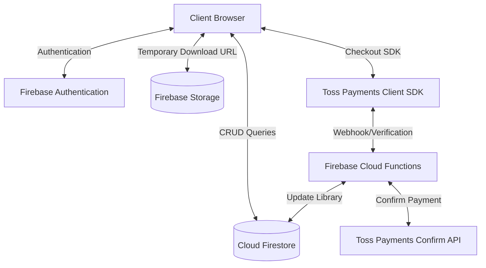

# AutoHub 상용 배포용 확장 개발 계획 (Firebase & Toss Payments)

이 계획서는 static 프론트엔드 프로토타입을 **Firebase** 백엔드 서비스(Auth, Firestore, Storage)와 **토스페이먼츠(Toss Payments)** 결제 시스템을 연동한 상용 웹 서비스로 전환하기 위한 기술 아키텍처 및 상세 구현 명세입니다.

---

## 1. 시스템 아키텍처 구성



---

## 2. 세부 개발 명세 및 Proposed Changes

### [NEW] Firebase Backend & Database
- **Authentication**: Firebase Authentication (이메일/비밀번호 로그인 및 소셜 로그인 지원)
- **Database**: Cloud Firestore (NoSQL 문서 데이터베이스)
- **File Storage**: Firebase Storage (파일 배포용)
- **Serverless Backend**: Firebase Cloud Functions (결제 승인 및 사후 검증, 보안 다운로드 URL 처리)

#### Cloud Firestore 데이터 모델 설계

##### `users` 컬렉션
- `uid` (Document ID)
- `email` (String)
- `name` (String)
- `role` (String: 'user' | 'admin')
- `createdAt` (Timestamp)

##### `catalog` 컬렉션
- `productId` (Document ID)
- `title` (String)
- `type` (String: '소스코드' | 'AI 직원')
- `price` (Number)
- `desc` (String)
- `icon` (String)
- `version` (String)
- `platform` (String)
- `imageUrl` (String)
- `filePath` (String, Firebase Storage 내 실제 다운로드 파일 경로)

##### `libraries` 컬렉션
- `libraryId` (Document ID)
- `userId` (String, User UID 외래 키)
- `productId` (String, Product ID 외래 키)
- `method` (String: 'paid' | 'free_promo')
- `unlockedAt` (Timestamp)

---

### [NEW] Security Rules (Firestore & Storage)
비인증 사용자의 쓰기 제한 및 관리자 권한 차단을 위한 보안 규칙을 설정합니다.
- **Firestore Security Rules**:
  ```javascript
  rules_version = '2';
  service cloud.firestore {
    match /databases/{database}/documents {
      // 일반 상품 조회는 누구나 가능
      match /catalog/{productId} {
        allow read: if true;
        allow write: if request.auth != null && request.auth.token.admin == true;
      }
      // 내 라이브러리는 본인만 조회 가능, 추가는 서버(Cloud Functions) 또는 결제 검증 후만 가능
      match /libraries/{libraryId} {
        allow read: if request.auth != null && request.auth.uid == resource.data.userId;
        allow write: if false; // 서버사이드(Admin SDK)에서만 쓰기 권한 부여하여 무단 추가 방지
      }
    }
  }
  ```

---

### [NEW] Toss Payments Integration (토스페이먼츠 연동)
- **도구**: Toss Payments Client SDK + Firebase Cloud Functions
- **구현 로직**:
  1. 클라이언트가 토스페이먼츠 결제창 호출 API 사용 (`requestPayment` 메서드 실행)
  2. 결제 성공 시 발급되는 `paymentKey`, `orderId`, `amount` 값을 클라이언트에서 수신
  3. 백엔드(Firebase Cloud Function `/confirmPayment`)로 해당 인자 전송
  4. Cloud Function에서 토스페이먼츠 결제 승인 API(`https://api.tosspayments.com/v1/payments/confirm`)로 POST 요청 발송 및 사후 검증
  5. 승인 완료 응답 수신 시 Firebase Admin SDK를 통해 Firestore `libraries` 컬렉션에 유저 권한 정보 등록 및 구매 완료 응답 전송

---

### [NEW] Secure Downloader Service
- **저장소**: Firebase Storage (`/products` 프라이빗 경로)
- **다운로드 로직**:
  1. 유저가 다운로드 버튼 클릭 시 Cloud Function `/getDownloadUrl` 호출
  2. Function 내부에서 사용자의 UID가 Firestore `libraries`에 해당 `productId` 권한을 구매했는지 검증
  3. 검증 통과 시 Firebase Storage Admin SDK를 이용해 5분 동안만 유효한 다운로드용 **임시 서명된 URL(Signed URL)**을 발급하여 프론트엔드로 반환
  4. 클라이언트 브라우저에서 자동으로 다운로드 트리거

---

## 3. 검증 계획 (Verification Plan)

### Firebase 에뮬레이터 통합 테스트
- 로컬 Firebase Emulator Suite를 구동하여 Auth, Firestore, Functions를 결합 테스트 수행
- 비인가 사용자의 다운로드 API 호출 시 권한 반려 검증

### 결제 승인 연동 테스트
- 토스페이먼츠 테스트 모드를 활성화하여 테스트 결제창 호출 및 `paymentKey`를 통한 백엔드 최종 승인 로직 통과 유무 검증
- 잘못된 금액(위변조)으로 승인 요청 시 Toss API 측에서 에러 처리하여 Firestore 라이브러리 추가가 차단되는지 확인

---

### [NEW] SEO & Geo-targeting (Seo.geo)
- **SEO (Search Engine Optimization) 최적화**:
  - **시맨틱 HTML5 구조**: 검색 엔진 크롤러가 사이트 구조를 쉽게 분석하도록 `<header>`, `<nav>`, `<main>`, `<section>`, `<article>`, `<footer>` 구성을 유지합니다.
  - **동적 Meta 태그 및 OG (Open Graph)**: 각 상품 페이지(`detail.html`) 로드 시 해당 상품의 `title`, `desc`, `imageUrl` 정보를 읽어 `<meta name="description">` 및 SNS 공유용 오픈그래프 메타 태그를 동적으로 설정합니다.
  - **구조화된 데이터 (JSON-LD)**: Schema.org 표준의 `Product` 및 `SoftwareApplication` 스키마를 JSON-LD 형식으로 주입하여 구글 검색 결과에서 가격, 평점, 버전 정보가 나타나도록 최적화합니다.
  - **Sitemap & robots.txt**: 크롤링 정책을 제어할 `robots.txt`와 사이트 맵 `sitemap.xml`을 자동으로 생성하여 검색 콘솔에 연동합니다.
- **Geo-targeting & Localization (글로벌 타겟팅)**:
  - **다국어(i18n) 지원**: 한국어(ko)와 영어(en) 리소스를 마련하고 브라우저 언어 설정 및 선택 언어에 따라 클라이언트를 동적으로 번역 렌더링합니다.
  - **Hreflang 태그**: 대체 페이지 관계를 검색엔진 크롤러에 명시하여 각 국가별 사용자에 최적화된 검색 결과 노출을 돕습니다.
  - **GeoIP 통화/가격 분기**: CDN 단에서 헤더에 담겨오는 유저 위치 정보(예: Cloudflare Country Header)를 파악해 한국(KR) 유저에게는 원화(KRW) 결제창과 토스페이먼츠 위젯을 제공하고, 해외 유저에게는 달러화(USD)와 페이팔/Stripe 결제 수단으로 자동 리다이렉트합니다.

